# BacklogZero — Devin Platform Integration Report

**Prepared by:** BacklogZero Engineering
**Date:** April 2026
**Audience:** Cognition Engineering & Partnerships Team

---

## Table of Contents

1. [Executive Summary](#1-executive-summary)
2. [Product Overview](#2-product-overview)
3. [Architecture Overview](#3-architecture-overview)
4. [Devin API Integration](#4-devin-api-integration)
5. [Issue-to-PR Pipeline](#5-issue-to-pr-pipeline)
6. [Security Remediation Workflow](#6-security-remediation-workflow)
7. [Governance & Auto-Approve Engine](#7-governance--auto-approve-engine)
8. [Analytics, ROI & Audit Reporting](#8-analytics-roi--audit-reporting)
9. [Slack Notification System](#9-slack-notification-system)
10. [Roadmap & Future Enhancements](#10-roadmap--future-enhancements)

---

## 1. Executive Summary

BacklogZero is an autonomous remediation platform that eliminates engineering debt and security vulnerabilities by integrating directly with the **Devin AI software engineer**. The system automates the full lifecycle of a GitHub issue — from initial triage and severity scoring to autonomous code repair, test verification, and Pull Request generation.

### Key Outcomes

| Metric | Value |
|:---|:---|
| **Issue-to-PR automation** | End-to-end, zero human code required |
| **Parallel fleet execution** | N issues resolved in constant wall-clock time |
| **Security remediation** | CodeQL alerts triaged and patched autonomously |
| **ROI multiplier** | ~3 engineer-hours saved per resolved issue |
| **Audit readiness** | Real-time compliance scoring with PDF export |

### Core Value Proposition

- **Autonomous Remediation**: Leverages Devin to write code, run tests, and verify fixes before human review.
- **AI-Driven Triage**: Automatically categorizes GitHub issues and CodeQL security alerts by severity and confidence.
- **Closed-Loop Feedback**: Integrates with Slack to keep teams informed of PR readiness and session blockers.
- **Audit Readiness**: Generates executive-level reports on remediation rates and security compliance.

The platform aims to provide a "hands-off" experience for maintainers where the only manual intervention required is the high-level approval of triaged batches and the final review of generated Pull Requests.

---

## 2. Product Overview

BacklogZero is a full-stack application consisting of a **React + TypeScript + Vite** frontend and a **FastAPI + SQLite** backend. It connects to three external services: **GitHub**, **Devin AI**, and **Slack**.

### Frontend Pages

| Path | Component | Description |
|:---|:---|:---|
| `/` | `Dashboard` | High-level metrics and ROI overview |
| `/issues` | `IssueTriage` | Triage and approval of GitHub issues |
| `/security` | `Security` | Management of CodeQL security findings |
| `/approvals` | `Approvals` | Reviewing Devin sessions and PR diffs |
| `/analytics` | `Analytics` | Historical trends and category breakdowns |
| `/integrations` | `Integrations` | Configuration for GitHub, Devin, and Slack |
| `/settings` | `Settings` | Repository management and general preferences |
| `/wiki` | `Wiki` | AI-generated codebase documentation |
| `/audit` | `AuditReport` | Compliance and executive summary exports |

### Backend Services

| Service | Responsibility |
|:---|:---|
| `GitHubService` | Issue sync, CodeQL alert ingestion, PR operations |
| `DevinService` | Session creation, prompt engineering, status polling |
| `SlackService` | Block Kit notifications, daily summary digests |
| `Database (aiosqlite)` | Persistent state for repos, issues, sessions, settings |

### Technology Stack

| Layer | Technology |
|:---|:---|
| Frontend | React 18, TypeScript, Vite, Tailwind CSS, React Router, Lucide React |
| Backend | Python 3.12+, FastAPI, aiosqlite, Pydantic, Poetry |
| Database | SQLite (async via aiosqlite) |
| External APIs | GitHub REST API v3, Devin API v1/v3, Slack Webhooks |

---

## 3. Architecture Overview

### High-Level Component Interaction

The following diagram illustrates how the system components interact to move an issue from discovery to resolution.

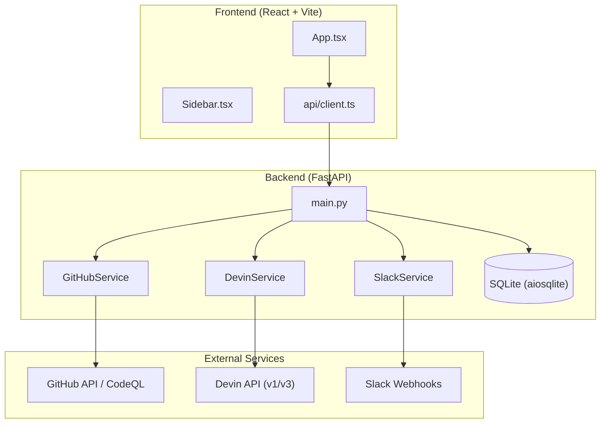

### Database Schema

The system persists state across six primary tables:

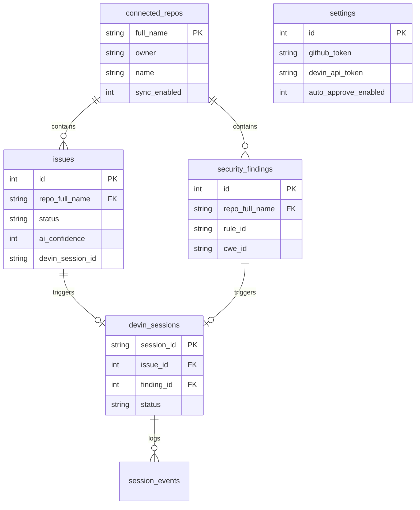

### Backend Router Architecture

| Router | Prefix | Responsibility |
|:---|:---|:---|
| `issues` | `/api/issues` | Issue CRUD, triage, approval pipeline |
| `security` | `/api/security` | CodeQL findings, compliance metrics |
| `devin_sessions` | `/api/devin` | Session proxy, status sync, message relay |
| `github_pr` | `/api/github` | PR diff, merge, comment, sync |
| `settings` | `/api/settings` | Tokens, automation config, validation |
| `analytics` | `/api/analytics` | KPI aggregation, ROI calculation |
| `repos` | `/api/repos` | Repository connection management |
| `slack` | `/api/slack` | Webhook testing, ad-hoc notifications |

---

## 4. Devin API Integration

### API Versioning and Routing

The `DevinService` class supports both **v1** and **v3** of the Devin API. Routing is determined at initialization based on the API token format and the presence of an Organization ID.

| Feature | v1 Implementation | v3 Implementation |
|:---|:---|:---|
| **Base URL** | `https://api.devin.ai/v1` | `https://api.devin.ai/v3/organizations/{org_id}` |
| **Token Format** | Personal API token | `cog_` prefix service user key |
| **Session ID Prefix** | None | `devin-` prefix required |
| **Message Endpoint** | `/sessions/{id}/message` | `/sessions/{id}/messages` |
| **Token Validation** | `limit=1` param | `first=1` param |

```python
# Routing logic
self.is_v3 = token.startswith("cog_") and bool(org_id)
if self.is_v3:
    self.base_url = f"{DEVIN_API_V3}/organizations/{org_id}"
else:
    self.base_url = DEVIN_API_V1
```

### Session Management Methods

| Method | Purpose |
|:---|:---|
| `create_session` | POST to `/sessions` with prompt, optional playbook_id and idempotency_key |
| `get_session` | Retrieve session details (handles `devin-` prefix for v3 automatically) |
| `list_sessions` | Fetch paginated session list |
| `send_message` | Post message to active session (critical for unblocking `waiting_for_user`) |
| `validate_token` | Lightweight check via listing one session |

### Session Data Flow

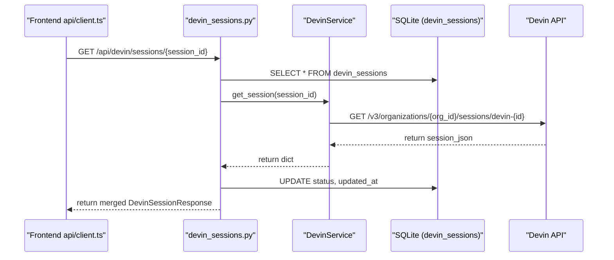

### Prompt Engineering & Git Authentication

Every prompt includes a mandatory Git Authentication block injected at the **TOP** to ensure Devin has write access to the target repository:

1. Re-configure the git remote using the provided `github_pat`
2. Avoid using the `git_create_pr` tool (may fail for private repos)
3. Use `curl` directly against the GitHub API to create Pull Requests

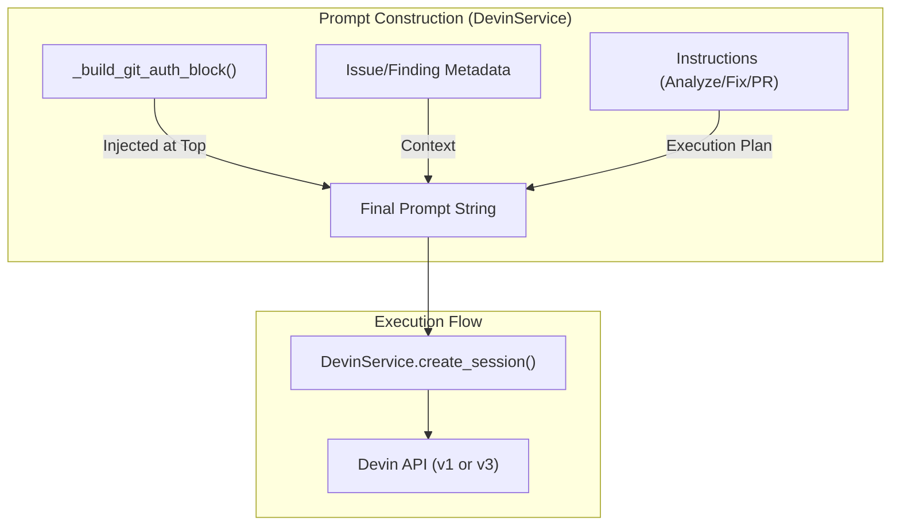

### Specialized Prompt Builders

| Builder | Context Included |
|:---|:---|
| `build_issue_prompt` | Issue number, title, body, labels |
| `build_security_prompt` | CWE ID, file path, line number, rule description |

---

## 5. Issue-to-PR Pipeline

The core workflow defines the end-to-end lifecycle of a bug or feature request. It transforms raw GitHub issues into verified Pull Requests through a hybrid model of AI autonomy and human oversight.

### The Five-Stage Lifecycle

| Step | Component | Description | Type |
|:---|:---|:---|:---|
| **Trigger** | GitHub Issues | Ingesting open issues via GitHub API | Trigger |
| **Step 1** | AI Triage | Filtering and assigning severity scores | Autonomous |
| **Step 2** | Human Approval | User selects batches for Devin to process | Checkpoint |
| **Step 3** | Devin Execution | Autonomous coding, testing, and recording | Autonomous |
| **Step 4** | PR & Notify | Pull Request creation and Slack alerts | Output |

### Pipeline Entity Mapping

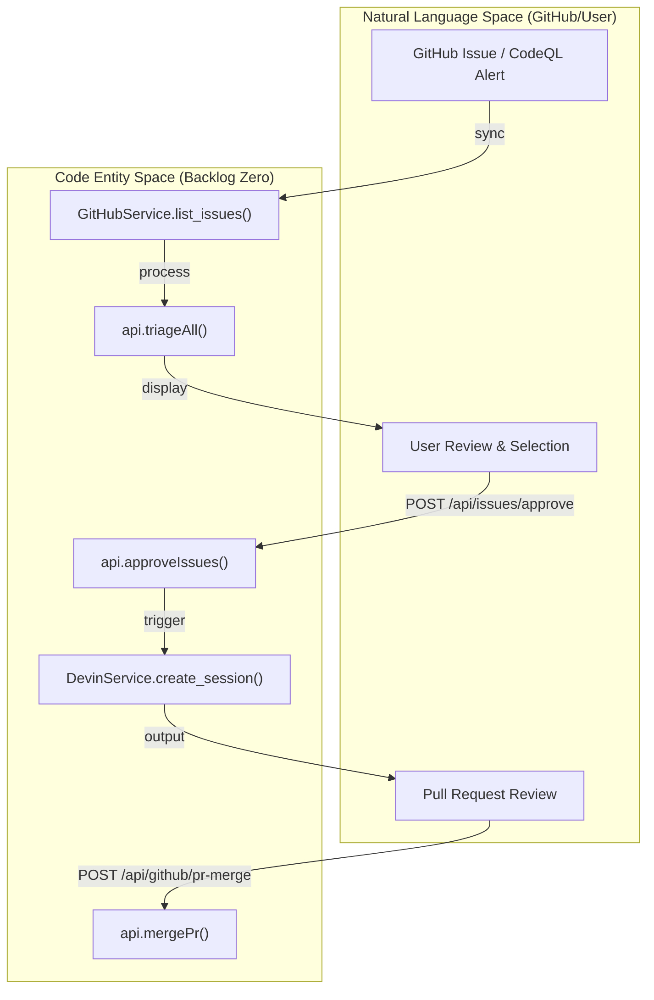

### Stage 1: Issue Ingestion & Triage

Issues are synchronized from connected repositories using `GitHubService.list_issues()`, which explicitly filters out Pull Requests returned by GitHub's API.

**AI Triage Scoring Metrics:**

| Metric | Purpose | Range |
|:---|:---|:---|
| **Severity** | Criticality (critical, high, medium, low) | 4 levels |
| **Category** | Nature of work (bug, security, feature, performance) | 6 types |
| **AI Confidence** | Predicted success rate for Devin | 0-100% |
| **Est. Effort** | Time complexity for fleet scheduling | Minutes |

### Stage 2: Human-in-the-Loop Approval

Before any code is modified, a human must approve the triaged items. Users can bulk-approve items, which transitions them from `triaged` to `approved` state.

### Stage 3: Background Session Creation

Approving issues triggers a non-blocking background task in FastAPI:

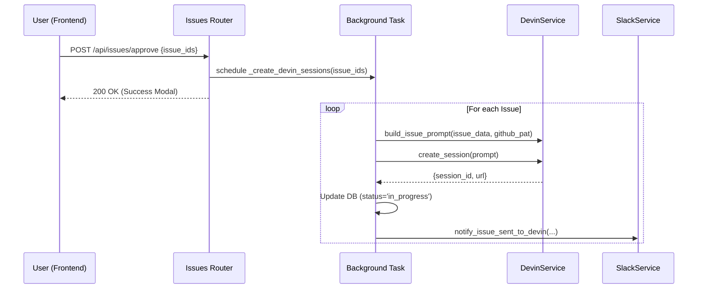

### Parallel Fleet Execution

Unlike human developers who work sequentially, the Devin integration allows for **linear cost scaling with constant time** for the entire batch:

- **Estimated Time**: Calculated as `max()` of estimated efforts (not sum)
- **Merge Rate**: Derived from average `ai_confidence` of the batch
- **Pipeline Steps**: Analyzing -> Writing fix -> Testing -> Opening PR

### Stage 4: PR Review & Merging

The Approvals page provides a two-panel review interface:

- **Left Panel**: AI summary, desktop recording, timeline & todos
- **Right Panel**: File tree with additions/deletions, syntax-highlighted unified diff

### Session State Machine

| State | Description | UI Indicator |
|:---|:---|:---|
| `running` | Devin actively executing | Clock icon, "In Progress" |
| `waiting_for_user` | Requires clarification or manual action | AlertCircle, "Needs Input" |
| `PR Ready` | Task completed, PR submitted | GitPullRequest, "PR Ready" |
| `merged` | PR successfully merged | CheckCheck, "Merged" |
| `failed` | Session terminated due to error | AlertCircle, "Failed" |

### PR Review and Merge Sequence

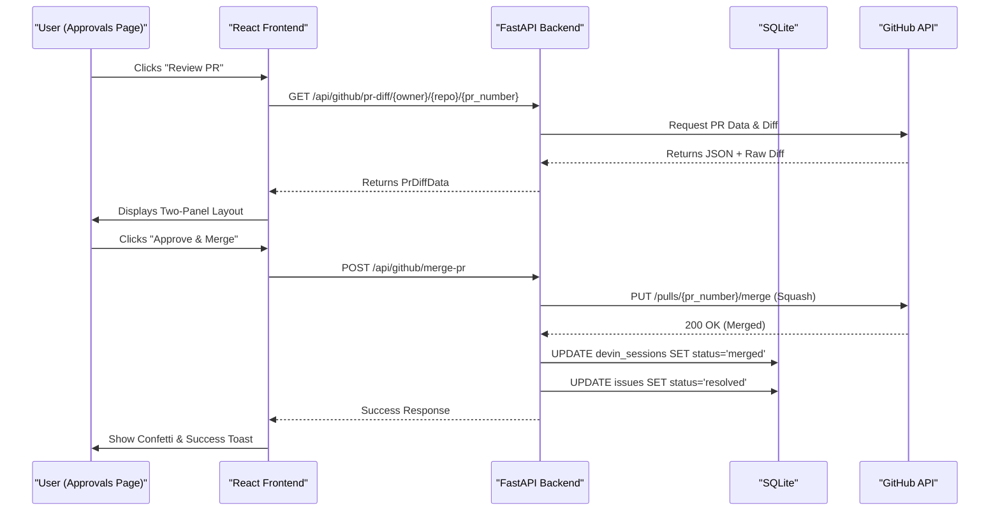

---

## 6. Security Remediation Workflow

The Security Findings module manages the ingestion, triage, and remediation of vulnerabilities detected by GitHub's CodeQL analysis. It mirrors the standard issue workflow but is specialized for code-scanning alerts.

### SecurityFinding Data Model

| Field | Source | Description |
|:---|:---|:---|
| `alert_number` | GitHub | Unique identifier for the alert within the repository |
| `rule_id` | GitHub | The specific CodeQL rule triggered (e.g., `js/sql-injection`) |
| `severity` | GitHub | Critical, High, Medium, or Low |
| `file_path` | GitHub | Location in source code where the vulnerability exists |
| `cwe_id` | GitHub | Common Weakness Enumeration identifier |
| `ai_summary` | Backend AI | Human-readable explanation of risk and proposed fix |
| `status` | System | Internal state: `open`, `triaged`, `approved`, or `resolved` |

### Security-Specific Metrics

- **Audit Readiness**: Visual representation of compliance score
- **Open Vulnerabilities**: Breakdown by severity (Critical/High)
- **Remediation Rate**: Percentage of historical findings resolved by Devin

### Finding-to-PR Lifecycle

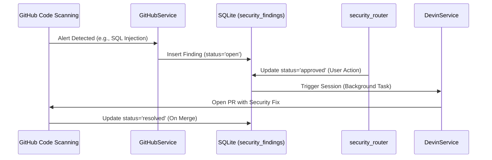

### Security Prompt Construction

When a finding is sent to Devin, the prompt includes:

1. **The Vulnerability Path**: Exact file and line number where the flaw was detected
2. **The Rule Description**: Details on why the code is unsafe (CWE identifiers)
3. **AI Summary**: Pre-calculated triage summary guiding Devin toward the correct fix

### Compliance API

| Endpoint | Method | Description |
|:---|:---|:---|
| `GET /api/security/findings` | GET | Filtered list sorted by severity |
| `POST /api/security/findings/approve` | POST | Transition to approved, trigger Devin |
| `GET /api/security/compliance` | GET | Aggregated compliance metrics |

---

## 7. Governance & Auto-Approve Engine

BacklogZero includes a governance layer that controls how autonomously the system operates, balancing speed with safety.

### Two-Token Security Model

The platform employs a dual-token strategy to ensure the principle of least privilege:

| Token Type | Purpose | Permissions Required |
|:---|:---|:---|
| **GitHub Token** | Read-only sync of issues and repo metadata | `repo`, `security_events` |
| **GitHub PAT** | Writing comments, merging PRs, Devin write-access | `repo` (Full), `workflow` |

### Auto-Approve Mode

For high-velocity environments, the system includes an Auto-Approve engine that bypasses manual PR review when specific criteria are met:

| Parameter | Description | Default |
|:---|:---|:---|
| `auto_approve_enabled` | Master toggle for autonomous merging | `false` |
| `auto_approve_confidence` | Minimum AI confidence score required | 90% |
| `max_severity` | Highest severity level allowed for auto-merge | `medium` |

**Auto-Approve Flow:**

1. A `useEffect` hook monitors the `sessions` array in real-time
2. Any session entering `PR Ready` status is automatically queued for merge
3. The `mergePr` function is invoked without user intervention
4. Squash merge strategy maintains clean repository history

### Repository Management

| Field | Type | Description |
|:---|:---|:---|
| `full_name` | `string` | The `owner/repo` identifier |
| `sync_enabled` | `boolean` | Whether the background worker polls this repo |
| `last_sync` | `string` | Timestamp of the last successful GitHub fetch |

### Integration Validation

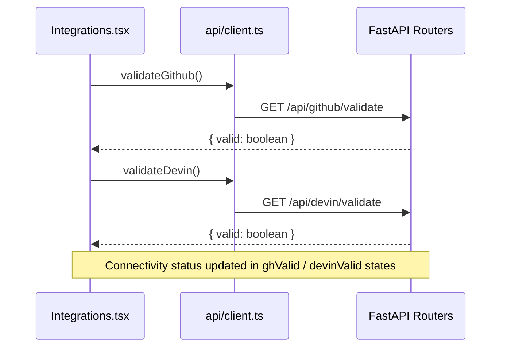

### PR Sync Matching Algorithm

Because Devin may create PRs asynchronously, the system includes `sync_prs_from_github`:

1. Iterates through all `connected_repos`
2. Fetches all open PRs from GitHub
3. **Regex Extraction**: Scans PR body for `Fixes #123` or `Closes #123` patterns
4. **Database Update**: Links matched PRs to `devin_sessions` with `PR Ready` status

### Automatic Status Propagation

When a PR is merged, the system triggers a cascade of updates:

1. **Session Update**: `devin_sessions` record set to `merged`
2. **Issue Update**: Linked issue set to `resolved`
3. **Notification**: `SlackService.notify_pr_merged` dispatched with time-to-resolution

---

## 8. Analytics, ROI & Audit Reporting

### Dashboard KPIs

The Analytics router aggregates data across all tables to provide high-level KPIs:

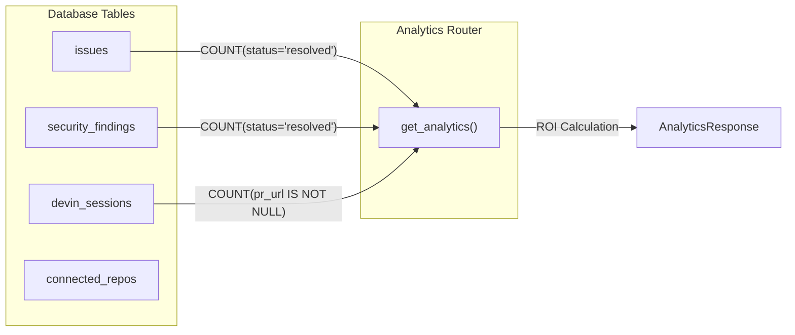

### Calculated Metrics

| Metric | Calculation | Description |
|:---|:---|:---|
| **Engineer Hours Saved** | `(issues_resolved + security_fixed) * 3.0` | Estimated dev time saved |
| **Compliance Score** | Weighted `remediation_rate` of security findings | Audit readiness indicator |
| **Category Breakdown** | `GROUP BY category` | Distribution of issue types |
| **Severity Breakdown** | `GROUP BY severity` | Distribution of criticality levels |
| **Backlog Burn Rate** | Net change in open issues per week | Trend indicator |

### Audit Report

The Audit Report page aggregates remediation metrics for compliance:

- **Data Retrieval**: `api.getAuditReport()` fetches the `AuditData` object
- **Compliance Metrics**: `compliance_score` and `remediation_rate_pct` based on resolved vs. open findings
- **PDF Export**: Generates standalone HTML with "Executive Summary" and "Severity Breakdown" table, sent to browser print dialog

### Status Endpoint (`/api/status`)

Real-time health and metrics overview:

| Metric | Logic |
|:---|:---|
| `repos_connected` | `SELECT COUNT(*) FROM connected_repos` |
| `devin_connected` | Validates `devin_api_token` via `DevinService.validate_token()` |
| `issues_count` | Count of issues with status `open`, `triaged`, or `approved` |
| `security_count` | Count of findings with status `open` or `triaged` |
| `review_count` | Count of issues in `in_progress` or `pr_open` states |

---

## 9. Slack Notification System

The Slack Notification Service provides real-time visibility into the BacklogZero pipeline using Slack's **Block Kit** for rich, interactive messages.

### Notification Types

| # | Type | Trigger | Content |
|:---|:---|:---|:---|
| 1 | **Issue Triaged** | New issue analyzed by AI | Repo, severity, category, AI summary, est. effort |
| 2 | **Sent to Devin** | User approves issue for remediation | Repo, issue details, Devin Session ID |
| 3 | **Needs Input** | Devin enters `waiting_for_user` state | Repo, issue, "Time Running" metric |
| 4 | **PR Ready** | Devin creates a Pull Request | Repo, issue, generated PR URL |
| 5 | **PR Merged** | User completes workflow by merging | Success message, merged PR link |
| 6 | **Session Failed** | Devin encounters error or timeout | Error status, session details |
| 7 | **Daily Summary** | Cron job or manual trigger | Total triaged, running, PRs ready, critical remaining |

### Notification Delivery Flow

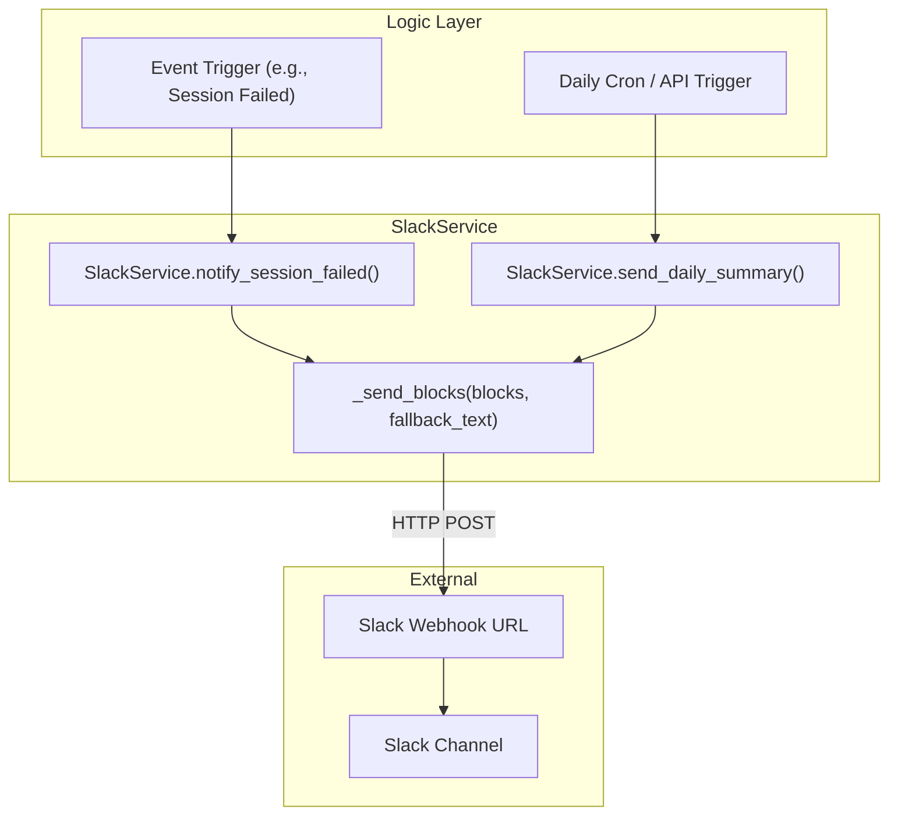

### SlackService Methods

| Method | Purpose |
|:---|:---|
| `_send_blocks` | Internal helper for Block Kit payloads via `httpx.AsyncClient` |
| `send_webhook` | Simple text messages for generic notifications |
| `validate_webhook` | Health check sending "connection successful" block |
| `notify_issue_triaged` | Rich notification with severity emoji, category, AI summary |
| `notify_issue_sent_to_devin` | Session ID and direct Devin link |
| `notify_devin_needs_input` | Urgency notification with "Respond in Backlog Zero" action |
| `notify_pr_ready` | PR URL with "Review PR" action button |
| `notify_pr_merged` | Success message with time-to-resolution |
| `notify_session_failed` | Error details and session context |
| `send_daily_summary` | Aggregated digest of system performance |

### Notification Preferences

Users can toggle specific notification types within Settings. The system checks `notify_on_triage`, `notify_on_pr_ready`, and similar flags before dispatching messages.

---

## 10. Roadmap & Future Enhancements

### Near-Term (Q2-Q3 2026)

| Feature | Description | Priority |
|:---|:---|:---|
| **LLM-Powered Triage** | Replace rule-based triage with LLM analysis for richer AI summaries | High |
| **Devin Playbook Integration** | Attach repo-specific playbooks to sessions for guided remediation | High |
| **Structured Output Schemas** | Use Devin v3 `structured_output_schema` for machine-readable session results | Medium |
| **Webhook-Based PR Sync** | Replace polling with GitHub webhooks for real-time PR status updates | Medium |
| **Multi-Org Support** | Support multiple Devin organizations within a single BacklogZero instance | Medium |

### Mid-Term (Q4 2026)

| Feature | Description | Priority |
|:---|:---|:---|
| **Devin Review Integration** | Leverage Devin Review as a quality gate before auto-merge | High |
| **Parallel Fleet Dashboard** | Real-time visualization of concurrent Devin sessions across repos | Medium |
| **Custom Prompt Templates** | Allow users to define per-repo prompt templates for Devin | Medium |
| **Scheduled Remediation** | Use Devin Scheduled Sessions for recurring backlog sweeps | Medium |
| **Child Session Orchestration** | Break large issues into sub-tasks using Devin child sessions | Low |

### Long-Term Vision

| Feature | Description |
|:---|:---|
| **Self-Healing Pipelines** | Auto-detect CI failures and trigger Devin to fix broken builds |
| **Cross-Repo Dependency Analysis** | Identify and remediate issues spanning multiple repositories |
| **Compliance Framework Mapping** | Map security findings to SOC 2, HIPAA, PCI-DSS frameworks |
| **AI Confidence Calibration** | Feedback loop using merge success rates to improve confidence scoring |
| **Enterprise SSO & RBAC** | Role-based access control with SAML/OIDC authentication |

### Integration Expansion

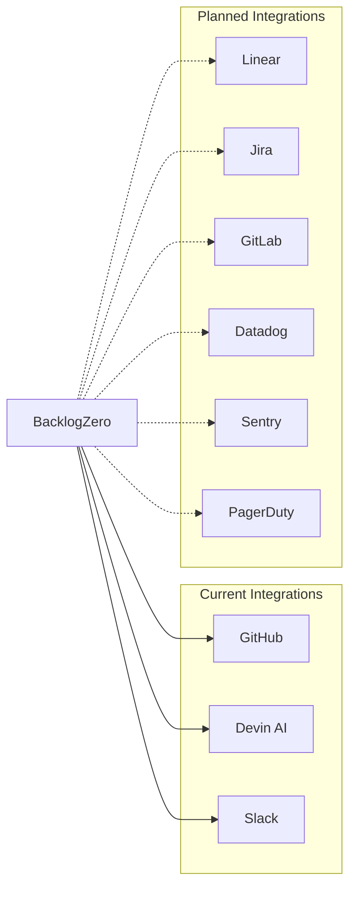

---

## Appendix A: Glossary

| Term | Definition |
|:---|:---|
| **ACU** | Agent Compute Unit — unit of cost for AI operations (~$0.09) |
| **Backlog Burn Rate** | Net change in open issues per week |
| **Confidence Score** | AI-predicted probability of a successful fix (0-100%) |
| **Parallel Fleet** | Running multiple Devin sessions simultaneously |
| **Pseudo-Session** | Queued item waiting for backend ID assignment |
| **Audit Readiness** | Compliance metric based on resolved findings ratio |
| **Devin Review** | AI quality gate analyzing PRs for bugs and security |
| **Sync & Triage** | Atomic operation refreshing GitHub data and AI analysis |
| **CodeQL** | GitHub's semantic code analysis engine for security scanning |
| **Block Kit** | Slack's UI framework for rich, interactive messages |

## Appendix B: API Endpoint Reference

| Router | Endpoint | Method | Description |
|:---|:---|:---|:---|
| Issues | `/api/issues/` | GET | List issues with filters |
| Issues | `/api/issues/{id}` | GET | Get single issue |
| Issues | `/api/issues/approve` | POST | Approve issues for Devin |
| Issues | `/api/issues/reject` | POST | Reject issues from queue |
| Security | `/api/security/findings` | GET | List security findings |
| Security | `/api/security/findings/approve` | POST | Approve findings for Devin |
| Security | `/api/security/compliance` | GET | Get compliance metrics |
| Devin | `/api/devin/sessions` | GET | List all sessions |
| Devin | `/api/devin/sessions/{id}` | GET | Get session with live sync |
| Devin | `/api/devin/sessions` | POST | Create new session |
| GitHub | `/api/github/pr-diff/{owner}/{repo}/{pr}` | GET | Get PR diff data |
| GitHub | `/api/github/merge-pr` | POST | Squash merge a PR |
| GitHub | `/api/github/pr-comment` | POST | Post comment on PR |
| GitHub | `/api/github/sync-prs` | POST | Sync PRs from GitHub |
| Settings | `/api/settings` | GET | Get current settings |
| Settings | `/api/settings` | PUT | Update settings |
| Settings | `/api/settings/validate/{service}` | POST | Validate integration |
| Analytics | `/api/analytics` | GET | Get analytics data |
| Slack | `/api/slack/notify` | POST | Send notification |
| Slack | `/api/slack/test` | POST | Test webhook |
| Status | `/api/status` | GET | System health overview |

---

*This document is confidential and intended for the Cognition Engineering & Partnerships Team. Distribution beyond the intended audience requires written approval from BacklogZero Engineering.*
